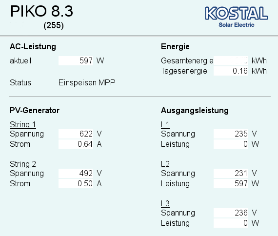

Anbindung Kostal Wechselrichter mit dem HTTP Binding
====================================================

Das folgende Beispiel zeigt die Anbindung eines Kostal Piko
Wechselrichter mit Hilfe des HTTP Binding. Damit alle visualisierten Werte dem gleichen Zeitpunkt entsprechen, wird in diesem Beispiel die Caching Funktion des HTTP Binding verwendet. Eine [englische Version](https://github.com/openhab/openhab/wiki/Samples-Binding-Config#how-to-get-data-from-kostal-piko-solar-inverter-via-http-binding) dieses Beispiels ist im  openHAB Wiki zu finden.  




Einrichten der Caching Funktion
------------------------------
Um die Caching Funktion des HTTP Bindings zu nutzen, muss die Datei *openhab.cfg* wie folgt geändert werden:  

```
############################### HTTP Binding ##########################################
#
# timeout in milliseconds for the http requests (optional, defaults to 5000)
#http:timeout=

# the interval in milliseconds when to find new refresh candidates
# (optional, defaults to 1000)
#http:granularity=

# configuration of the first cache item  
http:kostal-wechselrichter-cache.url=http://pvserver:<Passwort>@<IP_des_Wechselrichter>/index.fhtml
http:kostal-wechselrichter-cache.updateInterval=60000
```

* * * * *
<tr>
<td>  </td>
<td> Bitte ersetzen sie \<Passwort\> und \<IP_des_Wechselrichter\> mit den Daten ihren Anlage! </td>
</tr>
</table>
* * * * *


Konfigurieren der Items
-----------------------

```
/* AC Leistung */
Number Solar_Aktuell            "aktuelle Leistung [%.0f W]"  <inverter>   { http="<[kostal-wechselrichter-cache:30000:REGEX(.*aktuell</td>.*?([0-9]*)</td>.*)]" }

/* Energie */
Number Solar_Gesamt             "Ertrag (gesamt) [%.0f kWh]"  <energy>     { http="<[kostal-wechselrichter-cache:30000:REGEX(.*Gesamtenergie</td>.*?(\\d*)</td>.*)]" }
Number Solar_Tagesenergie       "Ertrag (am Tag) [%.2f kWh]"  <energy>     { http="<[kostal-wechselrichter-cache:30000:REGEX(.*Tagesenergie</td>.*?([0-9\\.]*)</td>.*)]" }

/* PV Generator String 1*/
Number Solar_PVG_Str1_Spannung  "String1 Spannung [%d V]"                  { http="<[kostal-wechselrichter-cache:30000:REGEX(.*?String 1.*?Spannung</td>.*?(\\d*)</td>.*)]" }
Number Solar_PVG_Str1_Strom     "String1 Strom [%.2f A]"                   { http="<[kostal-wechselrichter-cache:30000:REGEX(.*?String 1.*?Strom</td>.*?([0-9.]*)</td>.*)]" }

/* PV Generator String 2*/
Number Solar_PVG_Str2_Spannung  "String2 Spannung [%d V]"                  { http="<[kostal-wechselrichter-cache:30000:REGEX(.*?String 2.*?Spannung</td>.*?(\\d*)</td>.*)]" }
Number Solar_PVG_Str2_Strom     "String2 Strom [%.2f A]"                   { http="<[kostal-wechselrichter-cache:30000:REGEX(.*?String 2.*?Strom</td>.*?([0-9.]*)</td>.*)]" }

/* Ausgangsleistung & Spannung L1 */
Number Solar_AL_L1_Spannung     "L1 Spannung [%d V]"                       { http="<[kostal-wechselrichter-cache:30000:REGEX(.*?String 1.*?Spannung</td>.*?Spannung</td>.*?(\\d*)</td>.*)]" }
Number Solar_AL_L1_Leistung     "L1 Leistung [%d W]"                       { http="<[kostal-wechselrichter-cache:30000:REGEX(.*?String 1.*?Leistung</td>.*?(\\d*)</td>.*)]" }

/* Ausgangsleistung & Spannung L2 */
Number Solar_AL_L2_Spannung     "L2 Spannung [%d V]"                       { http="<[kostal-wechselrichter-cache:30000:REGEX(.*?L2</u></td>.*?Spannung</td>.*?Spannung</td>.*?(\\d*)</td>.*)]" }
Number Solar_AL_L2_Leistung     "L2 Leistung [%d W]"                       { http="<[kostal-wechselrichter-cache:30000:REGEX(.*?L2</u></td>.*?Leistung</td>.*?(\\d*)</td>.*)]" }

/* Ausgangsleistung & Spannung L3 */
Number Solar_AL_L3_Spannung     "L3 Spannung [%d V]"                       { http="<[kostal-wechselrichter-cache:30000:REGEX(.*?L3</u></td>.*?Spannung</td>.*?(\\d*)</td>.*)]" }
Number Solar_AL_L3_Leistung     "L3 Leistung [%d W]"                       { http="<[kostal-wechselrichter-cache:30000:REGEX(.*?L3</u></td>.*?Leistung</td>.*?(\\d*)</td>.*)]" }
```