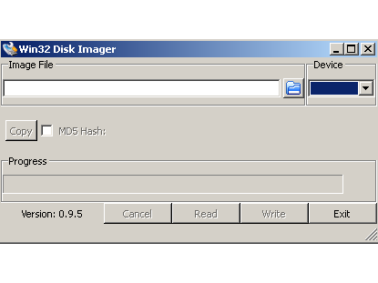

OpenHAB auf dem dem Raspberry PI
================================

Die folgenden Kapitel werden die Installation und Verwendung von [Raspbian](www.raspbian.org "Raspbian.org Homepage")
auf dem [Raspberry PI](http://www.raspberrypi.org/ "Raspberry PI Homepage") sowie die Nutzung von openHAB auf diesem System
erklären. Prinzipiell können für die Nutzung von openHAB auf dem
Raspberry PI auch andere Betriebssysteme verwendet werden. Im Folgenden
beschränke ich mich auf Raspbian. Hierbei handelt es sich wie bei den
meisten Linux Systemen um ein offenes Betriebssystem. Raspbian wurde
speziell für den Raspberry optimiert und basiert auf Debian. Dies
ermöglicht die Nutzung vieler Pakete (Programme) die für Debian
bereitgestellt werden. Der Name Raspbian setzt sich aus Raspberry und
Debian zusammen.

Raspbian installieren
---------------------

Das Raspbian Image kann entweder direkt von [raspberry.org](http://www.raspberrypi.org/downloads/) oder
[raspbian.org](http://raspbian.org/RaspbianImages) heruntergeladen werden. Alternativ kann für die
Installation von Raspbian oder andere Betriebssysteme auf dem Raspberry [NOOBS](http://www.raspberrypi.org/downloads/)
verwendet werden. Hierzu gibt es auf der Homepage raspberry.org
ausführliche [NOOBS-Installationsanleitungen](http://www.raspberrypi.org/help/noobs-setup/) und ein Video. Im
Handel gibt es SD Karte auf denen Raspbian oder NOOBS bereits vorinstalliert ist.
Dies erleichtert es für Anfänger, die sich nicht mit der Installation des Betriebssystems beschäftigen wollen.   
Im Folgenden wird die Installation des Raspbian-Images beschrieben. Für die initiale Installation empfiehlt es sich an den Raspberry einem Monitor oder TV sowie einer Tastatur und Maus anzuschließen.   

Materialien:  
- Raspberry PI incl. passendes USB-Netzteil mit einem mindest Ausgangsstrom von 1 A
- SD Speicherkarte mit mind. 4 GB Speicherplatz  
  (alternativ eine SD Karte mit vorinstalliertem Raspbian)
- TV oder Monitor mit HDMI Eingang
- HDMI Kabel
- USB Tastatur
- USB Maus (alternativ)
- PC mit Card Reader  
  (wird nur benötigt, wenn keine SD Karte mit vorinstalliertem Raspbian vorliegt)

Vorbereitung:  
Diese muss nur durchgeführt werden, wenn eine leere SD Karte vorliegt auf die das Raspbian-Image aufgespielt werden soll!

- Die aktuelle Raspbian Version von www.raspberrypi.org herunterladen und entpacken.
- Image auf SD Karte kopieren:
    - unter Windows:  
      Um das Raspbian-Image von einem Windows Betriebssystem auf die SD-Karte zu kopieren, kann das Programm
      [Win32DiskImager](http://sourceforge.net/projects/win32diskimager/files/) verwendet werden.  
        
      Nach Installation und Programmstart die SD-Karte und das Image auswählen, anschließend den Vorgang starten.
    - unter Linux:  
      Unter Linux kann das Programm dd verwendet werden. Das Programm dd ist bei den meisten Linux Distributionen bereits in der Grundinstallation enthalten. Um die Befehle ausführen zu können müssen die folgenden Befehle in einer Konsole ausgeführt werden.  
      Um dd verwenden zu können, muss zuerst der Gerätepfad (hier /dev/sdd) für die SD Karte ausfindig gemacht werden!
      1. `df -h` ausführen ohne gestekte SD Karte
      2. SD Karte in Lesegerät stecken
      3. `df -h` erneut ausführen die SD Karte sollte nun Beispielsweise wie folgt aufgelistet sein `/dev/mmcblk0pl` oder `/dev/sdd1`
      4. `dd bs=4M if=<Pfad zum Image>/2014-12-24-wheezy-raspbian.img of=/dev/sdd` kopiert das Image auf die SD Karte  
      In manchen Fällen ist das Aufspielen des Images mit dem Parameter bs=4M fehlerhaft, in diesem Fall das Ganze nochmals mit bs=1M testen.
- Nach dem Aufspielen des Image auf die SD-Karte, diese in den Raspberry einstecken und am TV oder Monitor sowie die Tastatur und Maus 
  anschließen. Beim ersten Start wird ein Konfigurationstool gestartet.  
  
  Sollte dies nicht der Fall sein, kann das Konfigurationstool mit folgenden Befehl gestartet werden:  
  ´sudo raspi-config´ 
  Im Konfigurationstool folgende Punkte nacheinander durchführen:
  1. Advanced Options --> ssh (ggf. bei neueren Version nicht mehr Notwendig)
  2. Change User Password
  3. Internationalisation Options (Sprache und Tastaturlayout)
  4. Expand_Filesystems

- Nach dem Einrichten der wichtigsten Einstellungen die Konfiguration mit <Finish> abschließen.  
  Der Raspberry boote neu, sollte dies nicht der Fall sein, kann dies mit dem Befehl durchgeführt werden:  
  `sudo reboot -now`

- Nach einem Neustart kann man sich mit dem neu erstellten Passwort anmelden oder wenn dies nicht geändert wurde mit  
  USER: pi, Passwort:raspberry  
  Achtung: Zu beginn ist die Tastatur nicht auf deutsch eingestellt, wodurch y und z vertauscht sind!

Installation des Midnight Commander (mc)
----------------------------------------

Nach erfolgreicher Installation von Linux sollte das sehr hilfreiche
Programm ´mc´ nicht fehlen. Damit der Midnight Commander installiert wird,
nach dem Hochfahren und Anmelden folgenden Befehl ausführen: 
´sudo apt-get install mc´ 
Danach wird man aufgefordert, das root-Passwort
einzugeben, dies ist das gleiche wie für den user pi. Nach Installation
kann das Programm mc wie folgt aufgerufen werden: ´mc´ (ohne root Rechte)
oder ´sudo mc´ (mit root Rechte)  

Statische IP-Adressen einrichten
--------------------------------

Standardmäßig läuft die Netzwerkkarte mit DHCP. Möchte man der
Netzwerk-Schnittstelle eine feste IP-Adresse zuweisen, muss unter
Linux die Datei ´/etc/network/interface´ angepasst werden. Die Datei
selbst kann allerdings nur von root angepasst werden. Um die Datei
anzupassen, wie folgt vorgehen:

1.  Wechseln in das entsprechende Verzeichnis
    ´cd /etc/network´

2.  Starten des Midnight Commander und öffnen der Datei interface  
    ´sudo mc´

3.  Standardmäßig sollte folgendes drin stehen:  
    

4.  Zum einrichten der festen IP Adresse, muss der Block für eth0 wie folgt geändert werden:  
    
    Erklärung:  
    static - Definition für feste IP-Adresse  
    address - Die IP-Adresse für das Interface  
    broadcast - Die Broadcast-Adresse (Endet meist auf .255)  
    netmask - Die Subnetzmaske  
    gateway - Das Gateway für Zieladressen die nicht im Lokalen Netz liegen

Quelle: http://juliusbeckmann.de/blog/statische-ip-adressen-in-debian-und-konsorten-einrichten.html

Java Installieren
-----------------

Seit kurzen hat sich die Java-Installation deutlich vereinfacht. Die
passenden hard-float oder soft-float Java Variante muss nicht von Oracle
heruntergeladen und über mehrere Schritte installiert werden. Raspbian
bringt nun die passende und hard-float unterstützende Java Version mit
und kann einfach mit folgenden Befehl installiert werden.  
    ´sudo apt-get update´
    ´sudo apt-get install oracle-java7-jdk´

openHAB auf dem Raspberry Einrichten
------------------------------------

Die „Installation“ von openHAB auf dem Raspberry ist gleich wie auf
einen PC. Damit später der Autostart funktioniert, wird empfohlen die
openHAB Dateien in das Verzeichnis /opt/openhab zu kopieren. Die Daten
mit Hilfe von WinSPC oder über einen gemounteten USB Stick und mc an die
gewünschte Stelle kopieren.

