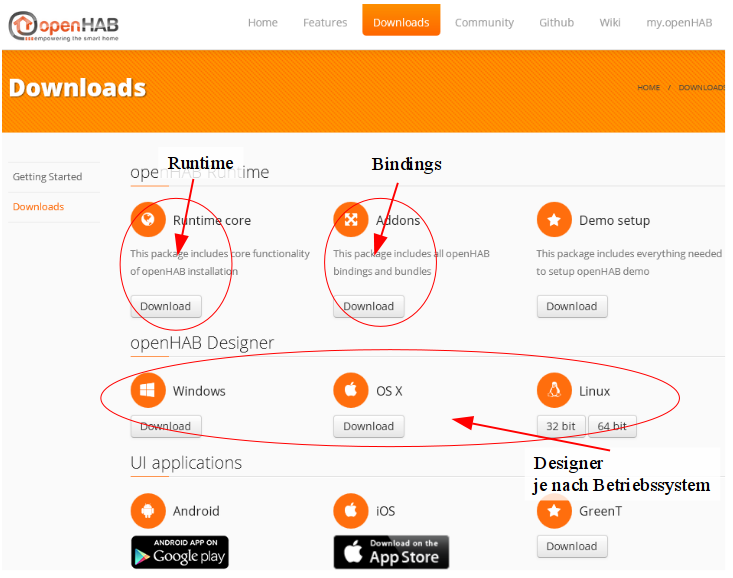

OpenHAB 2.x Installation auf PC
===============================

OpenHAB ist ein in Java geschriebenes Programm, das auf jedem
Betriebssystem läuft, auf dem Java installiert ist.

OpenHAB 2.x Runtime
-------------------
Die aktuelle Version kann von der Projektseite [openhab.org](http://www.openhab.org/downloads.html)
heruntergeladen und in einem beliebigen Ordner entpackt werden.  

z. B.:  
Linux: /openhab/runtime  
Windows: E:\openhab\runtime\

Um die Schreibweise zu vereinheitlichen, wird in den folgenden Kapiteln
das Verzeichnis in dem openHAB entpackt bzw. abgelegt wurde mit <Pfad\_zu\_openHAB\> ersetzt.
Zum Ausführen von openHAB, wechseln sie in das Verzeichnis <Pfad\_zu\_openHAB\> und führen abhängig
vom verwendeten Betriebssystem eines der beiden Scripte aus.  
Linux: start.sh  
Windows: start.bat

BINDING/ERweiterungen hinzufügen
--------------------------------

Für die Kommunikation mit anderen Geräten oder Funktionen sind
sogenannte Bindings notwendig. So wird zum Beispiel für die
Kommunikation zu einem KNX-Gateway das KNX Bindings benötigt.  

Nicht alle Bindings sind in der Version 2.x verfügbar, hierfür können die Bindings aus openHAB 1.x verwendet werden.
Bei einer Migration von openHAB 1.x auf openHAB 2.x kann es auch notwendig sein, 
Bindings von openHAB 1.x zu verwenden obwohl ein neues Binding verfügbar ist (z.B. das EXEC Binding, da in der neuesten Version keine Number Items unterstützt).  

Am einfachsten werden die Bindings / Erweiterungen in openHAB2 mit Hilfe der PaperUI hinzugefügt.
Nach erfolgreichem Start der openHAB2 Runtime, steht ihnen im Browser die Bedienoberfläche *PaperUI* zur Verfügung, mit ihr ist es möglich openHAB2 zu konfigurieren.  

Die *PaperUI* erreichen sie über ihren Browser und folgenden Link:

    http://localhost:8080

 
* * * * *
<table>
<tr>
<td>  </td>
<td> Einige Bindings müssen noch konfiguriert werden. </td>
</tr>
</table>
* * * * *

openHAB Designer
----------------

Es ist von Vorteil für die Arbeit mit openHAB den openHAB Designer zu
verwenden, da dieser Syntaxfehler erkennt und eine Autovervollständigung
implementiert hat. Der openHAB Designer kann auch von openHAB.org
heruntergeladen werden, dabei ist auf die Betriebssystemversion zu
achten. Nach dem Download den Designer in einem beliebigen Ordner
entpacken (z. B.: Linux: /openHAB/designer).
